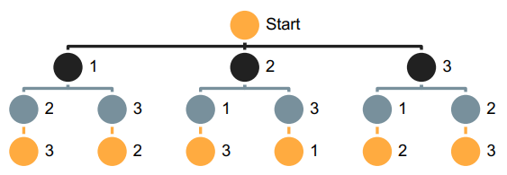
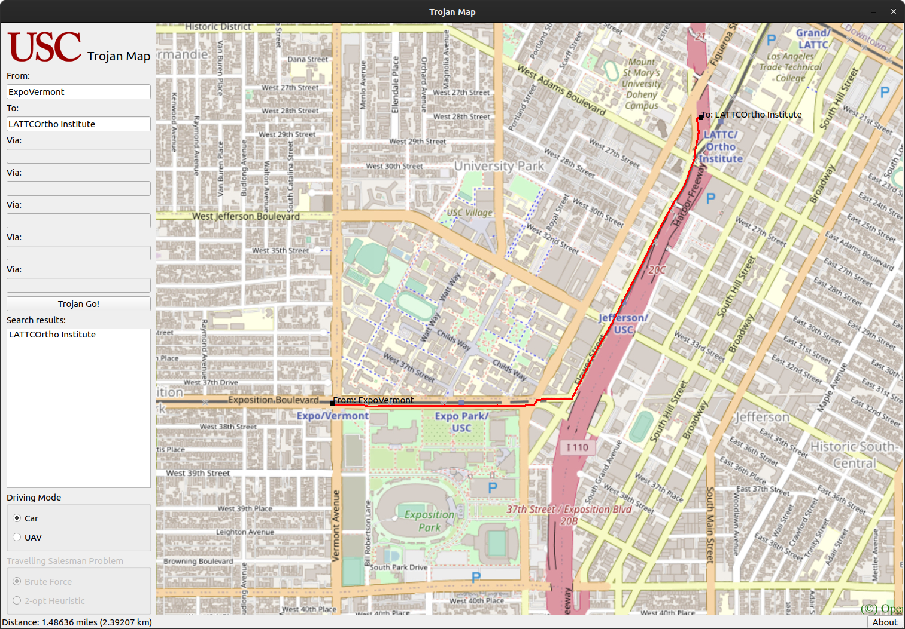

# Trojan Map  

This Project is based on the final project of EE599 (Computer Principles) in Spring 2021 at University of Southern California.

Author: Haoxin Ma (haoxinma@usc.edu)

## Overview

  ### Functionalities

  - Auto Complete location names
  - Find Coordinates
  - Calculate Shortest Path, using Dijkstra algorithm with heap sorting
  - Traveling Salesman Problem, using
    - Brute-force
    - 2-opt
  - Topological Sort (developing...)

  ### Basic Data Structure  

  ```c++
  class Node {
   public:
    string id;                 // A unique id assigned to each point
    double lat;                // Latitude
    double lon;                // Longitude
    string name;               // Name of the location
    vector<string> neighbors;  // List of the ids of all neighbor points
  };

  class TrojanMap {
   public:
    map<string, Node> data;    // A map of ids to Nodes
  };
  ```

The information of each `Node` is stored in `map.csv` (e.g. "Tommy Trojan")

```
id,lat,lon,name,neighbor
2305853438,34.0205678,-118.2854346,Tommy Trojan,['2305853437']
```

### File Description

`TrojanMap.pro` is the Qt Project File specifying c++ compiling rules, dependent Qt modules, dependent source files and resources

`main.cpp` is the main function

`traojanmap.h`, `traojanmap.cpp` are the source files for the graph algorithms

`mainwindow.ui` is the xml file for GUI initialization

`mainwindow.h`, `mainwindow.cpp` are the source files for GUI

`gtest.cpp` is the source file for unit testing using Google Test

`./googletest` is the folder storing a clone from repository https://github.com/google/googletest

`gtest_dependency.pri` is the Qt Project Include File specifying Google Test configurations (you should move this file into `./googletest` after cloning the repository)

`resource.qrc` is the Qt Resource File managing images and `map.csv`

`./img` is the folder for images

`map.csv` stores the information of each `Node` 

## Environment

My developing environment is: gcc 9.3, Qt 5.15. (Updated May 2021)

It is highly recommended to update your environment to the latest stable version.

### gcc

```shell
sudo apt update
sudo apt install build-essential
```

### git

```shell
sudo apt update
sudo apt install git
```

### Qt

See https://www.qt.io/download to download and install.

Additionally, to support OpenGL, please do the following:

```shell
sudo apt update
sudo apt install libglu1-mesa-dev
```

### Google Test

```shell
mv gtest_dependency.pri ./googletest
```


## Time Complexity Analysis

### Auto Complete location names  

  ```c++
vector<string> TrojanMap::Autocomplete(string name) {
    ...
        for (auto pr : data) { // O(v)
            transform(pr.second.name.begin(), pr.second.name.end(), str.begin(), ::tolower); // O(l)
            ...
        }
    ...
}
  ```

Time complexity: `O(v*l)`, where v is the number of vertices (locations), l is the max length of a location name 

### Find Coordinates  

  ```c++
pair<double, double> TrojanMap::GetPosition(const string &name) {
    ...
        for (auto pr : data) {...} // O(v)
    ...
}
  ```

Time complexity: `O(v)`, where v is the number of vertices (locations)  

### Calculate Shortest Path  

  ```c++
pair<double, vector<string>> Dijkstra(string id1, string id2); {
    ... 
    while (!q.empty()) { 
        ...                                     // O(v)
        for (auto nb_id : data[id].neighbors) { // O(e)
            ...
            q.push(make_pair(new_dis, nb_id));  // O(log(e))
        }
    }
    ...
}
  ```

Time complexity: `O(v+e*log(e))`, where v is the number of vertices (locations), e is the number of edges (paths) 

### Traveling Salesman Problem (Brute-Force)



Solving TSP using brute-force is just like a permutation which is shown above.

Time complexity: `O((v-1)!)`, where v is the number of vertices (locations)

### Traveling Salesman Problem (2-opt Heuristic)

Solving TSP using 2-opt heuristic algorithm is more efficient (but less accurate) than using brute-force.

Time complexity: `O(v^2)`, where v is the number of vertices (locations)

## Output Preview

  ### Car Path Planning Using Dijkstra Algorithm

  ###  

  ### Unmanned Aerial Vehicle (UAV) Path Planning Using Brute-Force  

  ### 

## Unit Testing

Use Google Test for unit testing in `gtest.cpp`

Here is the output in terminal if everything is ok.

```
[==========] Running 12 tests from 4 test suites.
[----------] Global test environment set-up.
[----------] 2 tests from Autocomplete
[ RUN      ] Autocomplete.InvalidInput
[       OK ] Autocomplete.InvalidInput (14 ms)
[ RUN      ] Autocomplete.ValidIInput
[       OK ] Autocomplete.ValidIInput (14 ms)
[----------] 2 tests from Autocomplete (29 ms total)

[----------] 2 tests from GetPosition
[ RUN      ] GetPosition.InvalidInput
[       OK ] GetPosition.InvalidInput (11 ms)
[ RUN      ] GetPosition.ValidInput
[       OK ] GetPosition.ValidInput (11 ms)
[----------] 2 tests from GetPosition (22 ms total)

[----------] 4 tests from Dijkstra
[ RUN      ] Dijkstra.InvalidInput
[       OK ] Dijkstra.InvalidInput (11 ms)
[ RUN      ] Dijkstra.ValidInput1
[       OK ] Dijkstra.ValidInput1 (19 ms)
[ RUN      ] Dijkstra.ValidInput2
[       OK ] Dijkstra.ValidInput2 (15 ms)
[ RUN      ] Dijkstra.ValidInput3
[       OK ] Dijkstra.ValidInput3 (19 ms)
[----------] 4 tests from Dijkstra (65 ms total)

[----------] 4 tests from TSP
[ RUN      ] TSP.InvalidInput
[       OK ] TSP.InvalidInput (10 ms)
[ RUN      ] TSP.ValidInput1
[       OK ] TSP.ValidInput1 (10 ms)
[ RUN      ] TSP.ValidInput2
[       OK ] TSP.ValidInput2 (11 ms)
[ RUN      ] TSP.ValidInput3
[       OK ] TSP.ValidInput3 (149 ms)
[----------] 4 tests from TSP (182 ms total)

[----------] Global test environment tear-down
[==========] 12 tests from 4 test suites ran. (300 ms total)
[  PASSED  ] 12 tests.
```

